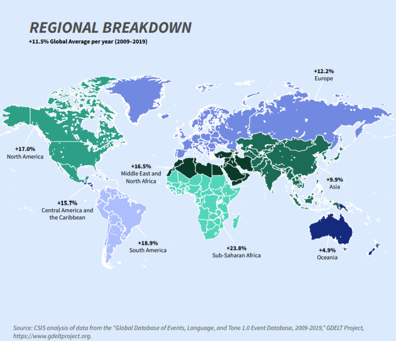
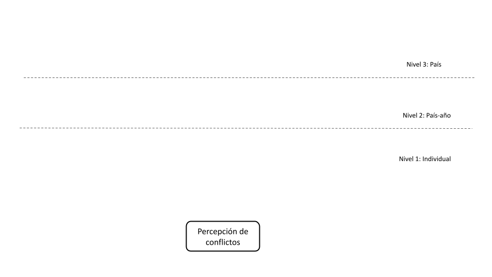
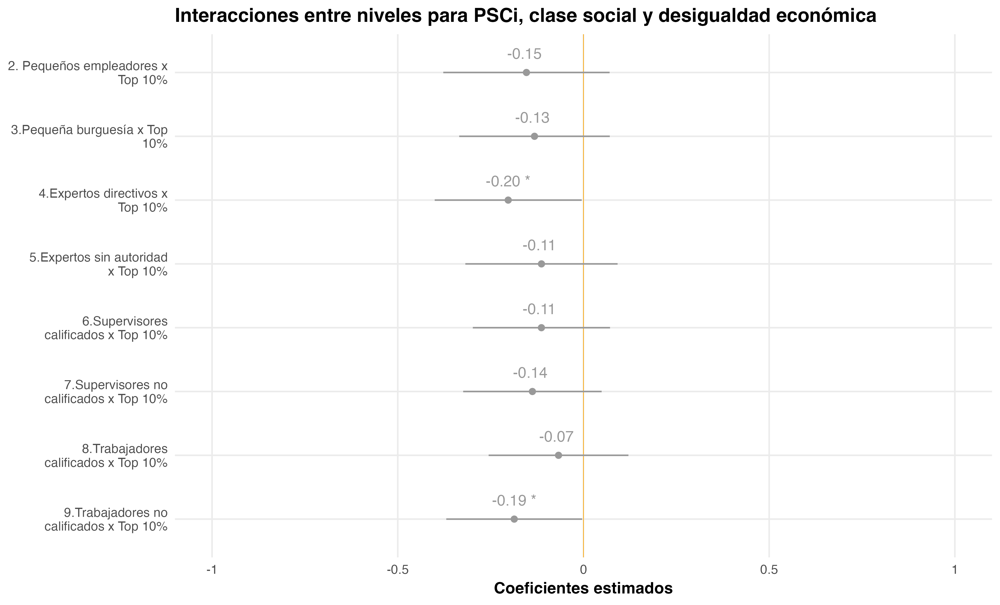

```{r database, message=TRUE, warning=TRUE, include=FALSE, paged.print=TRUE}

if (!require("pacman")) install.packages("pacman")

pacman::p_load(tidyverse, sjPlot, summarytools, 
               lme4, easystats, broom, broom.mixed, 
               influence.ME, ggrepel, ggpubr, performance, 
               lmerTest, ggeffects, knitr, icons, here, extrafont)

options(scipen=999)
rm(list = ls())

load(file = here("output", "db-proc.RData"))
load(file = here("output", "df2-proc.RData"))
load(file = here("output", "all_models.RData"))
```

```{r include=FALSE}

table_format = if(is_html_output()) {
  "html"
} else if(is_latex_output()) {
  "latex"
}
table_format2 = if(is_html_output()) {
  T
} else if(is_latex_output()) {
  F
}

```

```{r setup, include=FALSE, eval=TRUE}
knitr::opts_chunk$set(comment=NA, 
                      prompt=FALSE, 
                      cache=FALSE, 
                      echo=FALSE,
                      message = FALSE, 
                      warning = FALSE,
                      results='asis')

options(htmltools.dir.version = FALSE)

summarytools::st_options(bootstrap.css     = FALSE,
           plain.ascii       = FALSE,   
           style             = "rmarkdown",
           dfSummary.silent  = TRUE, 
           footnote          = NA,
           subtitle.emphasis = FALSE,
           headings =  F,
           lang =  "es")

summarytools::st_css()

options(kableExtra.html.bsTable = T)

options(knitr.kable.NA = '')


formatter <- function(...){
  function(x) format(round(x, 1), ...)
}


```

```{r xaringanExtra1, include=FALSE}
xaringanExtra::use_xaringan_extra(c("tile_view", "share_again", "scribble"))
```

class: middle hide-logo title


.pull-left-narrow[

<br>


<br><br><br>


.small[

X Conferencia Internacional COES]

.small[Noviembre 2023, Santiago]
]


.pull-right-wide[
.right[

<br>

.content-box-red[

## Percepciones de conflicto social: El rol de la clase social y la desigualdad económica en 33 países

]


----
.right[
.medium[
<div style="line-height:150%;">
Andreas Laffert Tamayo<sup>*</sup>
</div>
]
.small[
<div style="line-height:100%;">
<br>
*Departamento de Sociología, Universidad de Chile
<br>

Contacto: [andreas.laffert@ug.uchile.cl](andreas.laffert@ug.uchile.cl)
]
]
]
]

---

.left-column2[

### Contexto y motivación                                                                 
]

.right-column2[

]


---

class: gris

### .orange[Dimensión subjetiva del conflicto]

--

¿Cómo las personas captan estos conflictos sociales? (redistributivos)/ ¿Esta percepción varía según características individuales y contextuales?


--

.pull-left[

.content-box-red[

.red.bold.center[Individual]

.black[
* Desigualdades subjetivas .tiny[*(Hadler, 2017; Hertel & Schöneck, 2019)*]

* Organizaciones sociopolíticas .tiny[*(Kerrissey & Schofer, 2018; Ringqvist, 2020)*]

]
]

]
.pull-right[

.content-box-yellow[

.red.bold.center[Contextual]

.black[
* Desigualdad económica y extensión Estados de Bienestar .tiny[*(Edlund & Lindh, 2015)*]

* Concertación política y densidad sindical .tiny[*(Pérez, 2022; Ringqvist, 2020)*]
]
]


]


---

## Este estudio

Clase social (poca atención) .tiny[*(Edlund & Lindh, 2015; Pérez, 2022)*]


--

.pull-left[

.box-4.xlarge.sp-after-half[
1) Ampliar la relación empírica entre clase social y percepciones de conflicto

]
]

<br><br> 
--
.pull-right[

.box-4.xlarge.sp-after-half[
2) La forma en que la desigualdad económica puede moderar el efecto de la posición de clase es una pregunta aún sin respuesta

]
]

---
class: gris, middle center
 


<div style="text-align: justify">


.slarge[


.bold[*¿En qué medida la .yellow[clase social] afecta a las .yellow[percepciones de conflicto social] y cómo esta relación cambia a partir del rol del .yellow[contexto económico e institucional] entre 1999-2019?*]
]


---
### Hipótesis


.center[

]
---

### Hipótesis: nivel individual


.center[

]
 
 
---
### Hipótesis: nivel contextual


.center[

]

---
### Hipótesis: interacción


.center[

]


---
### Datos

<div style="text-align: justify">

.pull-left[

.large[
.coment[**Nivel individual**]

- Módulo de Desigualdad Social de la [ISSP](https://www.gesis.org/en/issp/modules/issp-modules-by-topic/social-inequality) en sus olas de 1999 (*N* = 6.175), 2009 (*N* = 21.932) y 2019 (*N* = 11.746).

- 33 países en diferentes olas.

]


</br>

.large[
.bold[Muestra final] compuesta por 39.853 individuos (nivel 1) anidados en 33 países (nivel 2).]

]

.pull-right[

.large[
.coment[**Nivel contextual**]

- [WIID](https://www.wider.unu.edu/database/world-income-inequality-database-wiid#WIIDcomp)

- [ICTWSS](https://www.ictwss.org/)

- [OCDE](https://data.oecd.org/economy.htm#profile-GDP%20and%20spending)

]
]


---

### Método

.large[

.bold[Modelos de regresión multinivel]

- efectos fijos y aleatorios
- interacciones entre niveles (pendiente aleatoria)

]


$$\begin{aligned}
  \operatorname{PSCi}_{ij} &\sim N \left(\mu, \sigma^2 \right) \\
    \mu &= \beta_0 + \beta_1\text{Clase}_{ij} + \beta_2\text{Sindicato}_{ij} + \beta_3\text{Top10}_{j} + \beta_4\text{Corporativismo}_{j} +
    \end{aligned}$$
    
$$\beta_5\text{Clase}_{ij} \times \text{Top10}_{j} + u_{0j} + u_{1j}X_{ij} + e_{ij}$$  

$$\begin{aligned}
\left(
  \begin{array}{c} 
    \begin{aligned}
      &u_{0j} \\
      &u_{1j}
    \end{aligned}
  \end{array}
\right)
  &\sim N \left(
\left(
  \begin{array}{c} 
    \begin{aligned}
      &\mu_{u0j} \\
      &\mu_{u1j}
    \end{aligned}
  \end{array}
\right)
, 
\left(
  \begin{array}{cc}
     \sigma^2_{u0j} & \rho_{u0ju1j} \\ 
     \rho_{u0ju1j} & \sigma^2_{u1j}
  \end{array}
\right)
 \right)
    \text{, para País j = 1,} \dots \text{, J}
\end{aligned}$$


---
### Variable dependiente 

.center[

]

<div style="text-align: justify">

.large[
.bold[Perceived Social Conflict Index] - $PSCi$: índice sumativo de estos indicadores. Sus valores oscilan entre 0 a 9 ( $\alpha$ = 0.83), *M* = 3.78, *DE* = 2.03, *ICC* = 0.22.

]
---
### Variables independientes

<div style="text-align: justify">
.pull-left[

.large[

.coment[**Nivel individual**]

- .bold[Posición de clase]: versión modificada de 9 categorías del esquema de clases de Erik Olin Wright (1997).

</br>

- .bold[Afiliación sindical]: *dummy* (0 = no miembro de sindicato, 1 = miembro de sindicato).


]
]

.pull-right[

.center[

]
]

---
### Variables independientes

<div style="text-align: justify">

.pull-left[

.large[
.coment[**Nivel contextual (país-año)**]

- .bold[Desigualdad económica]: porcentaje que captura el 10% más rico en los ingresos (concentración económica).

</br>

- .bold[Nivel de corporativismo]: índice desarrollado por Jahn (2016) a partir de Visser (2019) ICTWSS. 

]


.small[

_Controles_
+ N1: edad, sexo e ideología política.
+ N2: producto interno bruto (GDP) per cápita, gasto social (% GDP)
]

]

.pull-right[

.center[

]
]


---
### Modelos - determinantes individuales percepción de conflictos

.right-columnb[

.center[

]
]


<div style="text-align: justify">
</br>

.left-columnb[

.mlarge[

H1: ✓ .green[(β = 0.54, _p_ < .001)] 

H2: ✗ .red[(β = 0.04, _p_ > .05)]] 

.medium[
.footnote[Modelo 1 (FE-nivel individual). ∗∗∗ p < 0.001; ∗∗ p < 0.01; ∗ p < 0.05]
]

]


---
### Modelos - determinantes contextuales percepción de conflictos

.right-columnb[

.center[

]
]

<div style="text-align: justify">
</br>

.left-columnb[

.mlarge[

H3a: ✓ .green[(β = 0.64, _p_ < .001)] 

H4: ✓ .green[(β = -0.97, _p_ < .001)]]

.medium[
.footnote[Modelo 2 (FE-nivel individual y contextual). ∗∗∗ p < 0.001; ∗∗ p < 0.01; ∗ p < 0.05 ]

]
]


---
### Modelos - interacciones entre niveles

.right-columnb[

.center[

]
]

<div style="text-align: justify">
</br>

.left-columnb[

.mlarge[


H3a: ✓ .green[(β = 0.64, _p_ < .001)] 

H3b: ✗ .red[(β = -0.19, _p_ < .05)] 

H4: ✓ .green[(β = -0.97, _p_ < .001)]] 

.medium[
.footnote[Modelo 4 (FE-RE, incluye controles). ∗∗∗ p < 0.001; ∗∗ p < 0.01; ∗ p < 0.05 ]


]
]


---
### Modelos - interacciones entre niveles

.center[


]


---
class: gris

### Discusión y conclusiones


**<span style="color:yellow">1. Agenda de investigación:** dimensión subjetiva del conflicto como eje central de análisis </font>


**<span style="color:yellow">2. Factores socioeconómicos:** la clase como vehículo relevante de polarización social  </font>


**<span style="color:yellow">3. Mayor contribución empírica:** evidencia de una nueva relación entre la clase y el conflicto percibido en contextos
de alta desigualdad </font>


**<span style="color:yellow">4. Proyecciones:** medición, otros mecanismos de las desigualdades de clase y estudios de caso </font>


---

class: gris middle

# ¡Muchas gracias!

<br>


.right[
###Más información:

Github repo: [https://github.com/Andreas-Lafferte/conflict-perceptions](https://github.com/Andreas-Lafferte/conflict-perceptions)

Contacto: [andreas.laffert@ug.uchile.cl](andreas.laffert@ug.uchile.cl)
 
]


