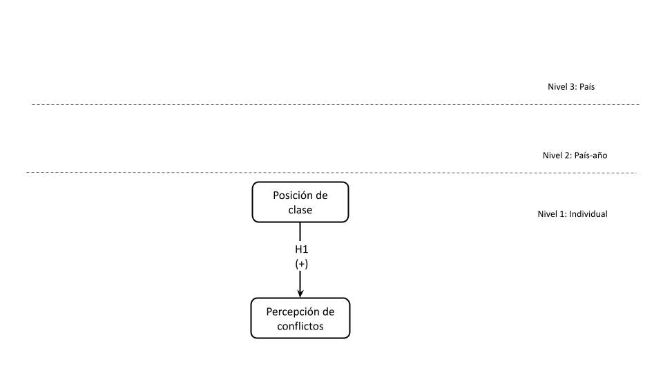
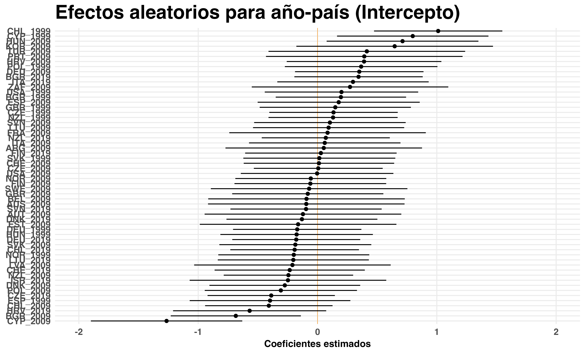

```{r database, message=TRUE, warning=TRUE, include=FALSE, paged.print=TRUE}

if (!require("pacman")) install.packages("pacman")

pacman::p_load(tidyverse, 
               sjPlot, 
               summarytools, 
               lme4, 
               easystats, 
               broom, 
               broom.mixed, 
               influence.ME, 
               ggrepel, 
               ggpubr, 
               performance, 
               lmerTest, 
               ggeffects, 
               knitr, 
               icons, 
               here, 
               extrafont,
               marginaleffects)

options(scipen=999)
rm(list = ls())

load(file = here("output/db-proc.RData"))
load(file = here("output/hybrid_models.RData"))
```

```{r include=FALSE}

table_format = if(is_html_output()) {
  "html"
} else if(is_latex_output()) {
  "latex"
}
table_format2 = if(is_html_output()) {
  T
} else if(is_latex_output()) {
  F
}

```

```{r setup, include=FALSE, eval=TRUE}
knitr::opts_chunk$set(comment=NA, 
                      prompt=FALSE, 
                      cache=FALSE, 
                      echo=FALSE,
                      message = FALSE, 
                      warning = FALSE,
                      results='asis')

options(htmltools.dir.version = FALSE)

summarytools::st_options(bootstrap.css     = FALSE,
           plain.ascii       = FALSE,   
           style             = "rmarkdown",
           dfSummary.silent  = TRUE, 
           footnote          = NA,
           subtitle.emphasis = FALSE,
           headings =  F,
           lang =  "es")

summarytools::st_css()

options(kableExtra.html.bsTable = T)

options(knitr.kable.NA = '')


formatter <- function(...){
  function(x) format(round(x, 1), ...)
}


```

```{r xaringanExtra1, include=FALSE}
xaringanExtra::use_xaringan_extra(c("tile_view", "share_again", "scribble"))
```

class: middle hide-logo title


.pull-left-narrow[
<br>


<br>


]


.pull-right-wide[
.right[

<br>

.content-box-red[

## Percepciones de conflicto social: El rol de la clase social y la desigualdad económica en 33 países entre 1999-2019

]


----
.right[
.medium[
<div style="line-height:150%;">
Andreas Laffert Tamayo<sup></sup>
</div>
]
.small[
<div style="line-height:100%;">
<br>
**<span style="color:red">Instituto de Sociología, Pontificia Universidad Católica de Chile**
<br>

VIII Seminario Internacional DEMOSAL

24-26 Marzo 2025, Brasil
]
]
]
]

---

.left-column2[

### Contexto y motivación                                                                 
]

.right-column2[

]


---

class: gris

### .orange[Dimensión subjetiva del conflicto]

--

¿Cómo las personas captan estos conflictos sociales? (redistributivos)/ ¿Esta percepción varía según características individuales y contextuales?


--

.pull-left[

.content-box-red[

.red.bold.center[Individual]

.black[
* Desigualdades subjetivas .tiny[*(Hadler, 2017; Hertel & Schöneck, 2019)*]

* Organizaciones sociopolíticas .tiny[*(Kerrissey & Schofer, 2018; Ringqvist, 2020)*]

]
]

]
.pull-right[

.content-box-yellow[

.red.bold.center[Contextual]

.black[
* Desigualdad económica y extensión Estados de Bienestar .tiny[*(Edlund & Lindh, 2015)*]

* Concertación política y densidad sindical .tiny[*(Pérez, 2022; Ringqvist, 2020)*]
]
]


]


---

## Este estudio

Clase social (poca atención) .tiny[*(Edlund & Lindh, 2015; Haddon & Wu, 2023; Pérez, 2022)*]


--

.pull-left[

.box-4.xlarge.sp-after-half[
1) Ampliar la relación empírica entre clase social y percepciones de conflicto

]
]

<br><br> 
--
.pull-right[

.box-4.xlarge.sp-after-half[
2) La forma en que la desigualdad económica puede moderar el efecto de la posición de clase es una pregunta aún sin respuesta

]
]

---
class: gris, middle center
 


<div style="text-align: justify">


.slarge[


.bold[*¿En qué medida la .yellow[clase social] afecta a las .yellow[percepciones de conflicto social] y cómo esta relación cambia a partir del rol del .yellow[contexto económico e institucional] entre 1999-2019?*]
]


---
### Hipótesis


.center[

]
---

### Hipótesis: nivel individual


.center[

]
 
 
---
### Hipótesis: nivel contextual


.center[

]
---
### Hipótesis: nivel contextual


.center[

]

---
### Hipótesis: interacción


.center[

]


---
### Datos

<div style="text-align: justify">

.pull-left[

.large[
.coment[**Nivel individual**]

- Módulo de Desigualdad Social de la [ISSP](https://www.gesis.org/en/issp/modules/issp-modules-by-topic/social-inequality) en sus olas de 1999 (*N* = 6.175), 2009 (*N* = 21.932) y 2019 (*N* = 11.746).

- 
.large[
.bold[Muestra final] compuesta por 39.464
individuos (nivel 1), anidados en 58 unidades países-años o encuestas (nivel 2), anidados en
33 países (nivel 3).]

]

]

.pull-right[

.large[
.coment[**Nivel contextual**]

- [WIID](https://www.wider.unu.edu/database/world-income-inequality-database-wiid#WIIDcomp)

- [ICTWSS](https://www.ictwss.org/)

- [OCDE](https://data.oecd.org/economy.htm#profile-GDP%20and%20spending)

]
]


---

### Método

.large[

**Modelos de regresión multinivel híbridos**

- Base de datos posee una estructura de encuestas longitudinales comparativas

- En estos modelos: cada encuestado/individuo (nivel 1) es observado en un país específico y en un momento específico (nivel 2), y cada año-país es una única observación de un país (nivel 3) que se observa repetidas veces .tiny[*(Fairbrother, 2014; Schmidt-Catran & Fairbrother, 2016)*]

- Modela la estructura de efectos aleatorios descomponiendo los efectos transverales _(between)_ y longitudinales dentro _(within)_ de los países

Formalmente:

]


$$\begin{aligned}
    y_{jti} = \beta_{0}(t) + \beta_{1}X_{jti} + \gamma_{WE}(Z_{jt} - \bar{Z}_{j}) + \gamma_{BE}\bar{Z}_{j} +v_{j} + u_{jt} + e_{jti}
    \end{aligned}$$


---
### Variable dependiente 

.center[

]

<div style="text-align: justify">

.large[
.bold[Perceived Social Conflict Index] - $PSCi$: índice sumativo de estos indicadores. Sus valores oscilan entre 0 a 9 ( $\alpha$ = 0.83), *M* = 3.78, *DE* = 2.03

]
---
### Variables independientes

<div style="text-align: justify">


.large[

.coment[**Nivel individual**]

.bold[Posición de clase]: 

- Se operacionaliza utilizando el esquema de clases de Erikson-Goldthorpe-Portocarrero (EGP) .tiny[*(Erikson & Goldthorpe, 1992)*]. 
- Esquema consistente y validado para sociedades industrializadas y de industrialización tardía .tiny[*(Barozet et al., 2021)*]. 

- Versión colapsada de tres categorías de clase: 

    * Clase de Servicios = directivos y profesionales superiores e inferiores
    * Clase Intermedia = trabajadores no manuales rutinarios y autónomos
    * Clase Trabajadora = supervisores manuales, trabajadores manuales calificados y no calificados


]


---
### Variables independientes

<div style="text-align: justify">


.large[
.coment[**Nivel contextual (país-año y país)**]

- .bold[Desigualdad económica]: porcentaje que captura el 10% más rico en los ingresos. Medida de concentración del ingreso .tiny[*(Chancel et al., 2022)*]


- .bold[Nivel de corporativismo]: índice desarrollado por Jahn (2016) a partir de Visser (2019) ICTWSS que aborda los aspectos estructurales, funcionales y de alcance del corporativismo.

]


_Controles_
+ N1: edad, sexo, nivel educacional, afiliación sindical e ideología política.
+ N2: producto interno bruto (GDP) per cápita

---
### Descriptivos 


.center[

]

---
### Modelos - variación percepción de conflicto

.right-columnb[

.center[

]
]


<div style="text-align: justify">
</br>

.left-columnb[

.mlarge[


$ICC_\text{country}$ = 0.16.


]

]

---
### Modelos - variación percepción de conflicto

.right-columnb[

.center[

]
]


<div style="text-align: justify">
</br>

.left-columnb[

.mlarge[


$ICC_\text{country}$ = 0.16.

$ICC_\text{country_wave}$ = 0.06


]

]

---
### Modelos - determinantes individuales percepción de conflictos

.right-columnb[

.center[

]
]


<div style="text-align: justify">
</br>

.left-columnb[

.mlarge[

H1: ✓ .green[(β = 0.25, _p_ < .001)] 

</br></br></br></br></br></br></br></br></br></br></br></br></br>

.small[
Modelo 2 (FE-nivel individual); Incluye controles; ∗∗∗ p < 0.001; ∗∗ p < 0.01; ∗ p < 0.05
]

]

]


---
### Modelos - determinantes contextuales percepción de conflictos

.right-columnb[

.center[

]
]

<div style="text-align: justify">
</br>

.left-columnb[

.mlarge[

H2a: ✓ .green[(β = 10.86, _p_ < .05)] 

H2b: ✓ .green[(β = 4.65, _p_ < .05)] 

H3: ✗ .red[(β = 0.02, _p_ > .05)] 

</br></br></br></br></br></br></br></br></br>

.small[
Modelo 3 (FE-nivel individual y contextual); No incluye controles; ∗∗∗ p < 0.001; ∗∗ p < 0.01; ∗ p < 0.05
]
]
]

---
### Modelos - determinantes contextuales percepción de conflictos

.right-columnb[

.center[

]
]

<div style="text-align: justify">
</br>

.left-columnb[

.mlarge[

H2a: ✓ .green[(β = 11.17, _p_ < .05)] 

H2b: ✗ .red[(β = 3.98, _p_ > .05)] 

H3: ✗ .red[(β = 0.02, _p_ > .05)] 

</br></br></br></br></br></br></br></br></br>

.small[
Modelo 4 (FE-nivel individual y contextual); Incluye controles; ∗∗∗ p < 0.001; ∗∗ p < 0.01; ∗ p < 0.05
]
]
]

---
### Modelos - interacciones entre niveles

.right-columnb[

.center[

]
]

<div style="text-align: justify">
</br>

.left-columnb[

.mlarge[

H2a: ✓ .green[(β = 11.17, _p_ < .05)] 

H2b: ✗ .red[(β = 3.98, _p_ > .05)] 

H3: ✗ .red[(β = 0.02, _p_ > .05)]

H4: ✗ .red[(β = -0.88 , _p_ < .05)]

</br></br></br></br></br></br></br>

.small[
Modelo 6 (Interacciones entre niveles); Incluye controles; ∗∗∗ p < 0.001; ∗∗ p < 0.01; ∗ p < 0.05
]
]
]


---
### Modelos - interacciones entre niveles

.center[


]


---
class: gris

### Discusión y conclusiones


**<span style="color:yellow">1. Agenda de investigación:** dimensión subjetiva del conflicto como eje central de análisis </font>


**<span style="color:yellow">2. Factores socioeconómicos:** la clase como vehículo relevante de polarización social  </font>


**<span style="color:yellow">3. Mayor contribución empírica:** evidencia de una nueva relación entre la clase y el conflicto percibido en contextos
de alta desigualdad </font>


**<span style="color:yellow">4. Proyecciones:** medición, otros mecanismos de las desigualdades de clase y estudios de caso </font>


---

class: gris middle

# ¡Muchas gracias!

<br>


.right[
###Más información:

Github repo: [https://github.com/Andreas-Lafferte/conflict-perceptions](https://github.com/Andreas-Lafferte/conflict-perceptions)

Contacto: [andreas.laffert@ug.uchile.cl](andreas.laffert@ug.uchile.cl)
 
]


